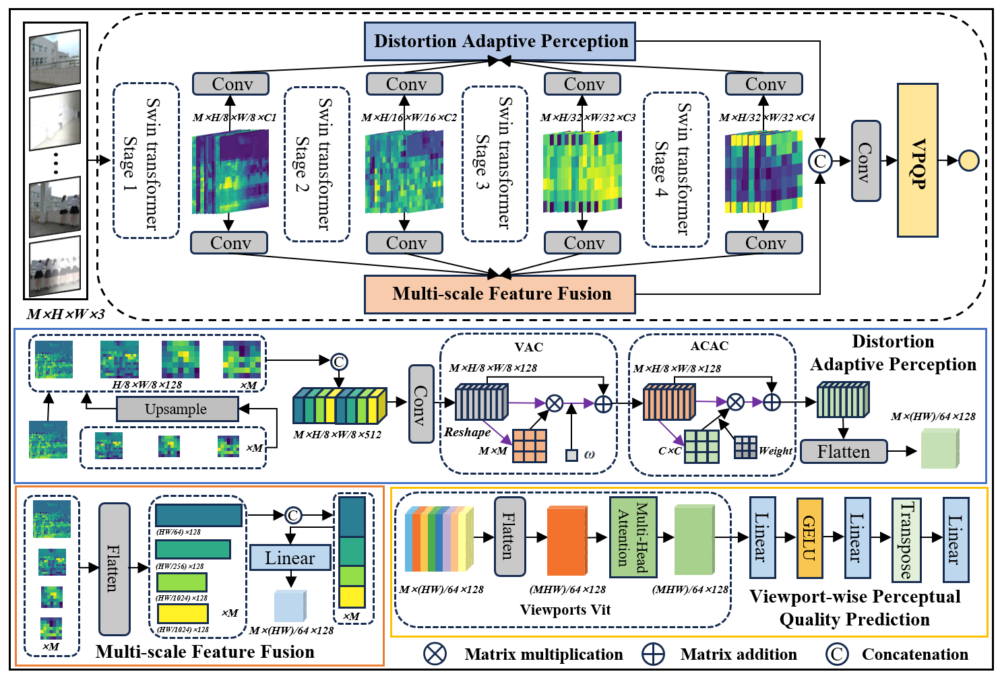

# Subjective and Objective Quality Assessment of Non-Uniformly Distorted Omnidirectional Images
[Jiebin Yan], [Jiale Rao], [Xuelin Liu] [Yuming Fang] [Yifan Zuo]  [Weide Liu]
## :book:Model Architecture



## :hammer_and_wrench: Usage

If you want to train the code on your database (e.g.  [CVIQ database](https://github.com/sunwei925/CVIQDatabase) ):

First, prepare the database
```sh
cd equi2cubic
ConvertCVIQtoCubic.m
```
Then
```sh
CUDA_VISIBLE_DEVICES=0 python train.py \
--num_epochs 10 \
--batch_size 40 \
--database CVIQ \
--data_dir /DATA/CVIQcubic \
--filename_train CVIQ/CVIQ_train.csv \
--filename_test CVIQ/CVIQ_test.csv \
--snapshot  /DATA/ModelFolder/VRIQA \
--cross_validation_index 1
```
If you want to test the trained model on the test set:

```sh
CUDA_VISIBLE_DEVICES=1 python test.py \
--database CVIQ \
--data_dir /DATA/CVIQcubic \
--filename_test CVIQ/CVIQ_test.csv \
--snapshot  /DATA/ModelFolder/VRIQA/CVIQ/1/CVIQ.pkl
```


### Training OIQAND
- Modify "dataset_name" to choose which datasets you want to train in config
- Modify training and validation dataset path

model_name and type_name is the file path for saving checkpoint and log file
```
python train_oiqa.py
```


