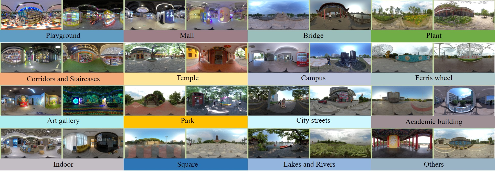
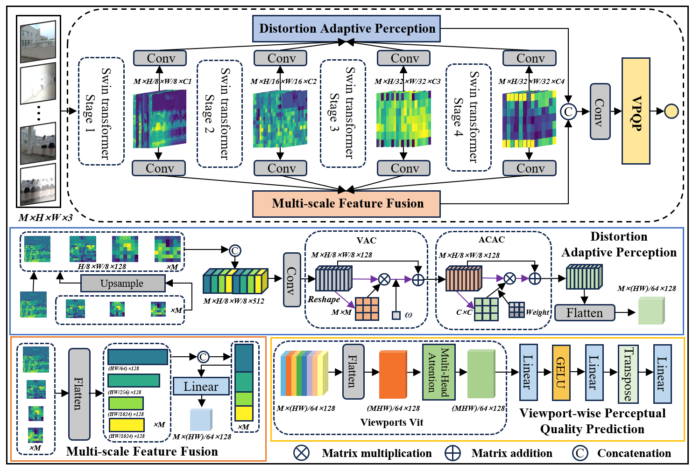

# Subjective and Objective Quality Assessment of Non-Uniformly Distorted Omnidirectional Images
[Jiebin Yan], [Jiale Rao], [Xuelin Liu], [Yuming Fang], [Yifan Zuo],  [Weide Liu]

## Database:JUFE-10K


You can be downloaded at the [Baiduyun](https://pan.baidu.com/s/1eL1yee3wISC1QVn4zXnXrw) (Password: JUFE)


## :book:Model Architecture



## :hammer_and_wrench: Usage

### Viewport Images Extraction
If you want to retrain the OIQAND model, using JUFE-10K database or another database, you first need to prepare viewport images.

- In get_viewport_images folder run demo.m
- Note: You can download the viewport images extracted from the JUFE-10K database directly from XXXX.com
```
run demo.m. 
```
### Training OIQAND
Then, you can select the corresponding training and test files under the file/JUFE-10K folder.

Modify the configuration in code/OIQAND_config.py

- Modify "dataset_name" to choose which datasets you want to train in config
- Modify training and test dataset path

```
sh oiqand_train_run.py
```


