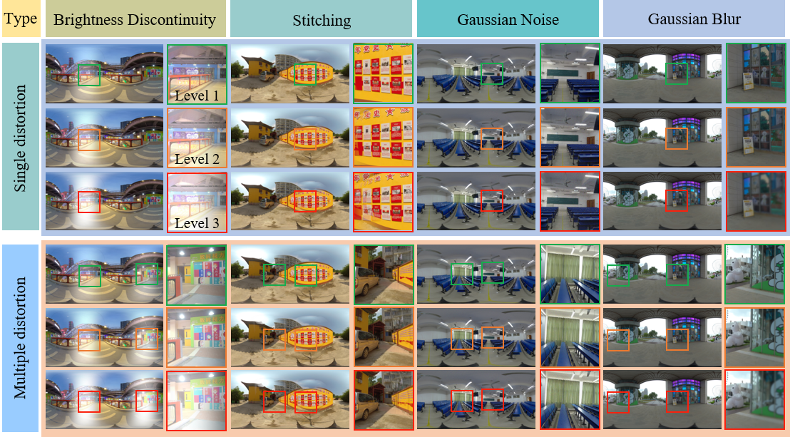

# Subjective and Objective Quality Assessment of Non-Uniformly Distorted Omnidirectional Images
[Jiebin Yan], [Jiale Rao], [Xuelin Liu], [Yuming Fang], [Yifan Zuo],  [Weide Liu]

## Database:JUFE-10K



You can be downloaded at the [Baiduyun](https://pan.baidu.com/s/1eL1yee3wISC1QVn4zXnXrw) (Password: JUFE)


## :book:Model Architecture


## :hammer_and_wrench: Usage

### Viewport Images Extraction
If you want to retrain the OIQAND model, using JUFE-10K database or another database, you first need to prepare viewport images.

- In get_viewport_images folder run demo.m
```
run demo.m
```
### Training OIQAND
Then, you can select the corresponding training and test files under the file/JUFE-10K folder.

Modify the configuration in Original_code/config.py

- Modify "dataset_name" to choose which datasets you want to train in config
- Modify training and test dataset path

```
sh run.sh
```

If you want to directly test OIQAND model trained on JUFE-10K, you can download Weights at [Baiduyun](https://pan.baidu.com/s/1KeY07G6j5yoWtyREstB7kA?pwd=jufe) (Password: jufe)

```
sh test-run.sh
```

NOTE: The code in the code folder is the refactoring code of OIQAND model. I hope it will be easy for you to understand about OIQAND model


## Citation
**If you find this code is useful for  your research, please cite**:

```latex
@article{yan2024oiqand,
  title={Subjective and Objective Quality Assessment of Non-Uniformly Distorted Omnidirectional Images},
  author={Yan, Jiebin and Rao, Jiale and Liu, Xuelin and Fang, Yuming and Zuo, Yifan and Liu, Weide},
  journal={IEEE Transactions on Multimedia},
  year={2024}
}
```

## Acknowledgement

1. <https://github.com/LXLHXL123/JUFE-VRIQA>
2. <https://github.com/TianheWu/Assessor360>
